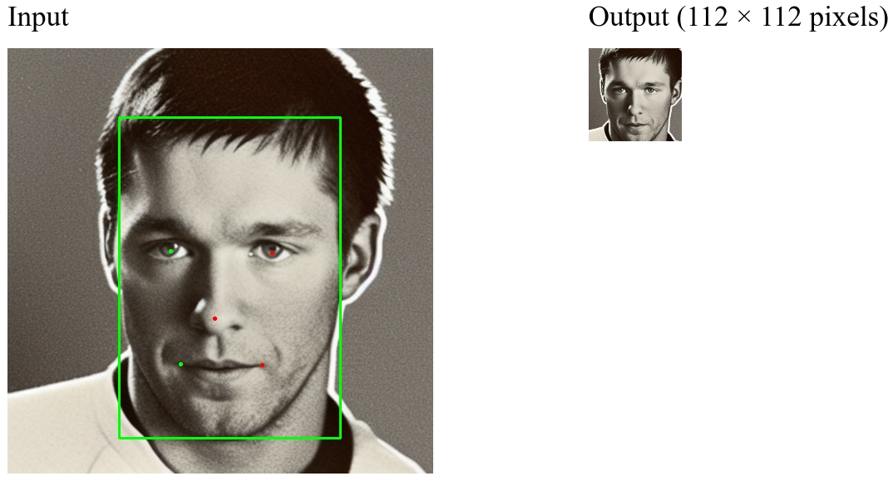

# Face Detection with RetinaFace



### Main requirements
- Python 3.9
- CUDA 11.2

### Config environment
```
git clone https://github.com/biesseck/insightface.git
cd insightface/detection

ENV=retinaface_insightface_py39
conda create --name $ENV python=3.9 -y
conda activate $ENV
pip3 install -r requirements.txt
git update-index --assume-unchanged retinaface/rcnn/pycocotools/_mask.c
```

### Compile RCNN
```
cd retinaface
make
```

### Download pre-trained model RetinaFace-R50

- Save file [retinaface-R50.zip](https://drive.google.com/file/d/1_DKgGxQWqlTqe78pw0KavId9BIMNUWfu/view?usp=sharing) to folder `retinaface/model`
```
mkdir model; cd model
gdown 1_DKgGxQWqlTqe78pw0KavId9BIMNUWfu    # if you get any SSL Certificate Error use 'gdown 1_DKgGxQWqlTqe78pw0KavId9BIMNUWfu --no-check-certificate'
unzip retinaface-R50.zip -d retinaface-R50
cd ../..    # come back to folder 'insightface/detection'
```

### Run face detection script
```
python detect_crop_faces_retinaface.py --input_path /path/to/dataset/root/folder --align_face --save_crops --process_only_biggest_face
```
- The following directory will be created with the same structure as '/path/to/dataset/root/folder':
  ```
  ├─ /path/to/dataset/root/folder
  ├─ /path/to/dataset/root/folder_DETECTED_FACES_RETINAFACE_scales=[0.5]_thresh=0.5_nms=0.4
        ├─ imgs_112x112
            ├─ subdir0
            |    ├─ img0.png
            |    ├─ img1.png
            |    ├─ img2.png
            ├─ subdir1
            |    ├─ img3.png
            |    ├─ img4.png
            |    ├─ img5.png
  
  ```


</br></br></br></br></br>


## Face Detection

<div align="left">
  
</div>


## Introduction

These are the face detection methods of [InsightFace](https://insightface.ai)


<div align="left">
  
</div>


### Datasets

  Please refer to [datasets](_datasets_) page for the details of face detection datasets used for training and evaluation.

### Evaluation

  Please refer to [evaluation](_evaluation_) page for the details of face recognition evaluation.


## Methods


Supported methods:

- [x] [RetinaFace (CVPR'2020)](retinaface)
- [x] [SCRFD (Arxiv'2021)](scrfd)
- [x] [blazeface_paddle](blazeface_paddle)


## Contributing

We appreciate all contributions to improve the face detection model zoo of InsightFace. 


